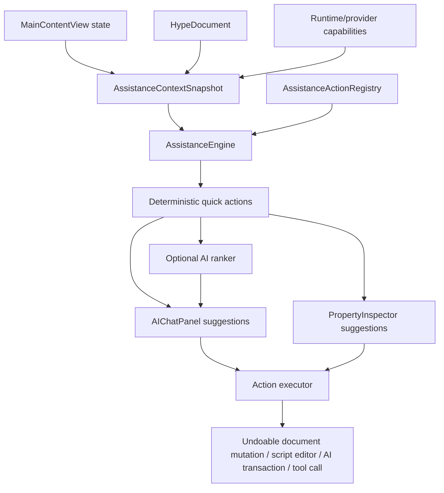

# Active AI Assistance Design

## Purpose

Hype should provide active AI assistance that reacts to the user's current authoring state and offers concrete next-step actions as quick-click buttons. The goal is to make Hype feel aware of the stack, selected object, target platform, and available authoring options without continuously sending the whole stack or screen state to a model.

The core design principle is deterministic assistance first, optional model ranking second. Hype already knows the current stack, card, background, selected parts, target platforms, layout constraints, available tools, and provider capabilities. That state should drive a typed recommendation system. A model may help rank or explain candidate actions, but it should not be required to discover basic next steps or directly mutate the document.

## Research Inputs

This design is grounded in Hype's current architecture and Apple's platform design guidance.

Repository sources:

- [`architecture.md`](architecture.md): document model, runtime boundaries, AI tool flow, target platform architecture, layout system, and selection model.
- [`decisions.md`](decisions.md): product guardrails for persistence, scripting, AI tooling, providers, target platforms, and runtime behavior.
- [`Sources/Hype/Views/ObjectToolCatalog.swift`](Sources/Hype/Views/ObjectToolCatalog.swift): canonical object creation catalog, target filtering, and part-type metadata.
- [`Sources/Hype/Views/MainContentView.swift`](Sources/Hype/Views/MainContentView.swift): main app state, selected parts, current tool, current card, target emulation, and AI panel integration.
- [`Sources/Hype/Views/PropertyInspector.swift`](Sources/Hype/Views/PropertyInspector.swift): per-object property editing, script editor entry points, and multi-selection editing.
- [`Sources/Hype/Views/AIChatPanel.swift`](Sources/Hype/Views/AIChatPanel.swift): existing AI chat, tool execution, transactions, scene proposals, and deterministic template routing.
- [`Sources/HypeCore/AI/HypeTools.swift`](Sources/HypeCore/AI/HypeTools.swift): AI tool surface for stack/card/background/object introspection, scripts, layout, target platforms, SpriteKit templates, and provider-safe editing.
- [`Sources/HypeCore/Layout/HIGLayoutCatalog.swift`](Sources/HypeCore/Layout/HIGLayoutCatalog.swift): target-aware HIG layout metrics and validation.

Apple primary references:

- [Apple Human Interface Guidelines: Layout](https://developer.apple.com/design/human-interface-guidelines/layout)
- [Positioning content relative to the safe area](https://developer.apple.com/documentation/uikit/positioning-content-relative-to-the-safe-area)
- [UIView safeAreaLayoutGuide](https://developer.apple.com/documentation/uikit/uiview/safearealayoutguide)
- [NSView safeAreaLayoutGuide](https://developer.apple.com/documentation/appkit/nsview/safearealayoutguide)
- [Apple Human Interface Guidelines: Accessibility](https://developer.apple.com/design/human-interface-guidelines/accessibility)
- [Apple Human Interface Guidelines: Buttons](https://developer.apple.com/design/human-interface-guidelines/buttons)
- [Apple Human Interface Guidelines: Focus and Selection](https://developer.apple.com/design/human-interface-guidelines/focus-and-selection)

Source count: 15 total sources, including 8 repository sources and 7 Apple primary references.

## First-Principles Position

Active assistance should answer three questions at every point in the authoring workflow:

1. What is the user focused on?
2. What useful actions are valid for that focus?
3. Which actions should be offered now without creating noise or risk?

This requires a precise state snapshot and a typed action catalog. It should not require the model to infer state from prose, UI screenshots, or large prompt context. The model should receive small, structured context only when Hype needs help ranking or explaining known-safe candidate actions.

## Non-Goals

- Do not continuously send full stack contents to a model.
- Do not continuously capture screen, audio, or user behavior outside Hype's own state model.
- Do not mutate the document automatically because the model recommends something.
- Do not persist live UI state, model ranking state, or runtime platform objects in `.hype` files.
- Do not replace existing tools, transactions, script validation, undo, or target platform validation.
- Do not add prompt bloat by embedding the full action catalog in every AI request.

## Architecture Overview

The feature should be implemented as four layers:

1. `AssistanceContextSnapshot`: a compact, derived, non-persisted view of current authoring state.
2. `AssistanceActionDescriptor`: a typed description of a possible user action and its executor.
3. `AssistanceActionRegistry`: a deterministic catalog of possible actions by scope, part type, target platform, and precondition.
4. `AssistanceEngine`: a debounced evaluator that turns snapshots into ranked quick actions.

Optional AI ranking sits above this deterministic layer. The AI ranker may reorder or explain candidate actions, but it should not invent privileged mutations or bypass Hype's tool and transaction surfaces.

## AssistanceContextSnapshot

`AssistanceContextSnapshot` should be a value type in `HypeCore` or a low-level shared module so tests can exercise it without launching the app.

Recommended fields:

- `documentRevision`: monotonically changing revision or digest for cache invalidation.
- `currentStackSummary`: stack id, name, target platforms, layout policy, theme, card/background counts.
- `currentCardSummary`: card id, name, size, background id, part count, transition settings, script state.
- `currentBackgroundSummary`: background id, name, part count, script state.
- `mode`: browse, edit, paint, script editing, sprite editing, runtime preview, target emulation.
- `currentTool`: selected tool from `ToolManager`.
- `selectedPartSummaries`: id, name, type, rect, style summary, script presence, help presence, enabled/visible/locked state.
- `selectedNodeSummaries`: SpriteKit/Scene3D node summaries when editing inside a scene.
- `selectionKind`: none, single part, multiple parts, sprite node, scene node, paint layer, card, background, stack.
- `targetProfiles`: selected platforms and current emulated profile.
- `layoutValidationSummary`: safe-area, hit-size, spacing, overlap, and target compatibility issues.
- `providerCapabilities`: OpenAI, Ollama, llama-swap, image generation, speech, MusicKit, Meshy, local-only mode, network availability.
- `runtimeStatus`: whether the stack is running, paused, executing a script, or has recent script errors.
- `recentUserEvent`: optional coarse event such as part created, part selected, script error surfaced, layout warning appeared, target changed.

The snapshot must be derived from document and UI state. It should not be saved into the stack file.

## AssistanceActionDescriptor

Each quick action should be a typed descriptor.

Recommended fields:

- `id`: stable machine-readable action id.
- `title`: short user-facing button text.
- `rationale`: one-sentence explanation shown on hover or in expanded mode.
- `scope`: stack, background, card, selection, part, scene, node, paint, runtime, provider, target layout.
- `priority`: deterministic base priority.
- `preconditions`: typed checks that must pass before showing the action.
- `riskLevel`: safe, writesDocument, opensEditor, scriptExecution, network, paidProvider, externalFile, destructive.
- `requiredCapabilities`: image generation, speech, MusicKit authorization, Meshy, SpriteKit, Scene3D, script editor, target layout.
- `supportedTargets`: macOS, iPhone, iPad, tvOS, or all selected targets.
- `executor`: command that runs through existing mutation, undo, script editor, transaction, or tool paths.
- `undoLabel`: label used by the undo system when the action mutates the document.
- `analyticsKey`: optional local diagnostic key for feature-quality telemetry.

Actions that write stack content should always use `HypeDocumentMutationCoordinator` or an equivalent undo-aware path. Multi-step AI edits should use the AI transaction path with preview/apply/rollback.

## AssistanceActionRegistry

The registry should be deterministic and table-driven. It should use the same canonical part taxonomy as `ObjectToolCatalog` so Hype does not drift into duplicate or inconsistent object behavior.

Registry grouping:

- Stack actions.
- Background actions.
- Card actions.
- Multi-selection actions.
- Per-`PartType` actions.
- Sprite scene and node actions.
- Scene3D actions.
- Paint actions.
- Provider and runtime actions.
- Target platform and layout actions.

The registry should support action discovery by code and by AI tools. The model should be able to ask Hype for available actions in the current state rather than requiring the full catalog in the prompt.

## AssistanceEngine

The engine should observe state changes from `MainContentView` and produce a small set of suggested next steps.

Recommended behavior:

- Debounce frequent changes such as dragging and text edits.
- Evaluate cheap deterministic rules synchronously.
- Run heavier diagnostics, such as layout validation or scene analysis, asynchronously and cancellably.
- Cache results by snapshot digest and action catalog version.
- Return 3 to 7 suggestions by default.
- Suppress repeated suggestions after dismissal until state meaningfully changes.
- Prefer specific object-level suggestions over generic stack suggestions.
- Prefer safe/local actions over network-backed actions unless the user has opted in.
- Never execute an action without a direct user click or explicit script/tool request.

## Optional AI Ranking

AI ranking should be capability-gated and context-minimized.

The model should receive:

- Compact snapshot summary.
- Candidate action ids, titles, scopes, and rationales.
- Recent user event.
- User's active prompt if the AI chat is open.

The model should not receive:

- Full stack data by default.
- API keys or provider configuration secrets.
- Raw image/audio blobs.
- External file contents unless the user explicitly attached them.
- Full scripts unless the action is explicitly script-related and the user asks for script help.

The model may return:

- Ranked action ids.
- One-line explanations.
- A suggestion that no AI ranking is useful.

The model may not return:

- Direct document mutations.
- Arbitrary tool calls outside the selected action path.
- Hidden network operations.

## UI Integration

### AI Chat Panel

Add a "Suggested next steps" strip above the prompt input area.

Behavior:

- Show compact buttons for the top suggestions.
- Include a disclosure affordance for rationale/details.
- Keep suggestions visible while the user types unless the typed prompt clearly changes context.
- If a quick action opens an editor, keep the AI panel open and update suggestions after the action completes.
- If a quick action starts a multi-step AI edit, show preview/apply/rollback just like existing AI transactions.

Example after creating a button:

- Add `on mouseUp`
- Navigate to next card
- Set button style
- Add help text

### Property Inspector

Add a small "Next Steps" section for the selected object or selected group.

Behavior:

- Keep this section below core object identity and geometry properties.
- Show only actions scoped to the current selection.
- Avoid duplicating actions already visible as primary inspector controls unless they are common next steps.

### Menu and Preferences

Add preferences:

- Enable Active Assistance.
- Show suggestions in AI panel.
- Show suggestions in inspector.
- Allow provider-assisted ranking.
- Allow network-backed suggestions.
- Suggestion verbosity: quiet, balanced, proactive.

Add a menu item:

- `View > Active Assistance Suggestions`

The menu item should toggle the suggestions surface but should not disable the underlying deterministic action system if another UI surface is using it.

## Object-Type Recommendation Matrix

### Stack

Recommended quick actions:

- Choose or revise target platforms.
- Validate stack for selected deployment targets.
- Add a new card.
- Add a new background.
- Edit stack script.
- Set stack theme.
- Add project memory note.
- Review external dependencies.
- Package for runtime target.

### Background

Recommended quick actions:

- Add shared navigation.
- Add shared header or footer.
- Edit background script.
- Move repeated card controls to background.
- Apply or set background theme.
- Validate background layout across targets.
- Show cards using this background.

### Card

Recommended quick actions:

- Add card title/header.
- Choose or change background.
- Add next/previous navigation buttons.
- Set transition effect.
- Edit `openCard` or `closeCard` script.
- Validate HIG layout.
- Preview target device layout.
- Add a starter form, gallery, scene, or media block.

### Multi-Selection

Recommended quick actions:

- Group selected objects.
- Ungroup selected group.
- Align left, right, top, bottom, centers, or baselines.
- Distribute horizontally or vertically.
- Apply common style.
- Pin to safe area.
- Create target-aware layout constraints.
- Validate common target availability.

### Button

Recommended quick actions:

- Add `on mouseUp`.
- Navigate to next card.
- Navigate to previous card.
- Open script editor.
- Convert to toggle behavior.
- Add icon.
- Add tooltip/help text.
- Set default/cancel role where appropriate.
- Validate hit size for selected targets.

### Field and Label-Like Text

Recommended quick actions:

- Make label.
- Make editable input.
- Make search field.
- Make secure field.
- Add placeholder text.
- Add validation script.
- Add `openField`, `closeField`, or `exitField` handler.
- Set tab order.
- Align text vertically and horizontally.
- Validate text size and safe-area layout.

### Shape, Divider, and Visual Container

Recommended quick actions:

- Make panel/container.
- Make separator.
- Set fill and stroke.
- Set corner radius.
- Send backward or bring forward.
- Add help text.
- Add simple animation script.
- Use as card section background.

### Image and Animated GIF

Recommended quick actions:

- Choose image.
- Generate replacement image.
- Add to sprite library.
- Toggle animation on click.
- Set scaling mode.
- Add transparency or crop options.
- Add `mouseUp` script.
- Validate self-contained asset storage.

### Web, PDF, and Video

Recommended quick actions:

- Set source.
- Import into stack when possible.
- Add playback controls.
- Add page navigation controls.
- Bind source to a field.
- Validate portability.
- Add load/error script handlers.

### Chart, Progress, Gauge, and Data-Like Controls

Recommended quick actions:

- Add sample data.
- Bind value to field or script variable.
- Choose chart style.
- Add legend or labels.
- Add update script.
- Validate target layout.

### Sprite Area

Recommended quick actions:

- Create game template.
- List available game templates.
- Get template design guide.
- Add sprite asset.
- Add tile map.
- Add physics boundaries.
- Add `sceneDidLoad`.
- Add frame-update handler.
- Add contact/collision handler.
- Validate scene diagnostics.
- Open sprite scene setup UI.

### Sprite Node

Recommended quick actions:

- Set physics body.
- Set category and collision masks.
- Add movement script.
- Add animation.
- Convert to player/enemy/pickup/projectile.
- Add to group.
- Rename for script access.

### Scene3D

Recommended quick actions:

- Bind model from repository.
- Import model.
- Generate model.
- Add camera.
- Add light.
- Set background.
- Add interaction script.
- Validate model asset and USDZ fallback.

### Paint Layer

Recommended quick actions:

- Choose brush.
- Change color.
- Clear paint layer.
- Export paint layer.
- Convert paint layer to image asset.
- Save paint layer into stack.

### Audio Recorder

Recommended quick actions:

- Record audio.
- Save recording into stack.
- Add playback button.
- Add transcription if provider is available.
- Add script event for recording completion.

### AudioKit Controls

Recommended quick actions:

- Choose instrument.
- Create note pattern.
- Add keyboard script.
- Add step sequencer pattern.
- Play test note.
- Save generated music into stack.
- Add `play`, `stop`, or sequence script.

### MusicKit Search

Recommended quick actions:

- Authorize Apple Music.
- Search song, album, artist, or playlist.
- Select result.
- Play selected result.
- Add stop button.
- Add seek control.
- Bind search criteria to fields.

## AI Tooling Additions

Add tools that expose the assistance system to the embedded model without putting the full catalog in prompt context.

Recommended tools:

- `get_active_assistance_snapshot`: returns compact current state.
- `list_active_assistance_actions`: returns valid actions for the current state.
- `get_active_assistance_action_details`: returns details for one action.
- `execute_active_assistance_action`: executes a selected deterministic action, subject to safety rules.
- `dismiss_active_assistance_action`: records user dismissal until context changes.

Tool safety:

- `execute_active_assistance_action` must use the same undo, validation, transaction, and provider-gating rules as the UI.
- Network-backed actions must be marked as network or paid-provider risk.
- Script-inserting actions must validate generated HypeTalk.
- File-import actions must preserve stack portability rules.

## HypeTalk and Script Editor Integration

Script-oriented quick actions should use an explicit script editor insertion API rather than raw string mutations.

Examples:

- Button selected with no script: insert a valid `on mouseUp ... end mouseUp` skeleton and place the cursor inside the handler.
- Card selected: offer `openCard`, `closeCard`, and transition-related handlers.
- Background selected: offer shared navigation or state initialization handlers.
- Sprite area selected: offer `sceneDidLoad`, frame update, key handling, mouse handling, and contact handlers supported by the interpreter.
- Music controls selected: offer play, stop, seek, instrument, and pattern examples supported by the current HypeTalk implementation.

All generated scripts must pass the existing parser/check-script path before saving or being presented as a ready-to-apply action.

## Target Platform and HIG Behavior

The assistance layer should treat target platform compatibility as first-class state.

Rules:

- Suggestions must respect the selected target platforms.
- Object suggestions must be filtered by `PartAvailabilityCatalog`.
- Layout suggestions must use target profiles and safe areas.
- If multiple targets are selected, suggestions should prefer controls and layouts that work across all selected targets.
- iPhone and iPad must remain distinct targets because form factor and layout needs differ.
- tvOS suggestions should consider focus/remote interaction rather than pointer-first assumptions.

Examples:

- If a small button violates touch target expectations for iPhone/iPad, suggest "Increase hit size for touch targets."
- If an object is outside the safe area in target emulation, suggest "Pin to safe area."
- If a selected control is not available across all selected targets, suggest "Replace with cross-target control" or "Adjust target platforms."

## Persistence and Undo

Active assistance state should not be persisted into `.hype` files except for explicit user-authored results.

Persist:

- Scripts inserted by user-approved quick actions.
- Objects, layout constraints, assets, and properties created by user-approved quick actions.
- Project memory notes when explicitly written by the user or AI through an approved action.

Do not persist:

- Current suggestion list.
- Dismissed suggestions except possibly as app preference/session state.
- AI ranking decisions.
- Provider transient responses.
- Live runtime object references.

Every document-mutating quick action must be undoable with a meaningful undo label.

## Security and Safety Review

Risks and mitigations:

- Prompt/context leakage: use compact snapshots and candidate action ids, not full stack dumps.
- Secret leakage: never include API keys, account tokens, MusicKit credentials, or provider settings in AI ranking context.
- Accidental mutation: require explicit user click for every quick action.
- Script execution risk: validate inserted scripts and do not run them automatically unless the user requests execution.
- Network/paid-provider risk: gate image generation, Meshy, OpenAI, MusicKit network actions, and external file reads behind capabilities and user intent.
- Persistence corruption: route all writes through existing document mutation and undo pathways.
- Target-platform drift: validate suggestions against selected targets before showing them.
- UI noise: debounce, suppress dismissed suggestions, and show only a small number of actions.

## Implementation Phases

### Phase 1: Foundation

- Add `AssistanceContextSnapshot`.
- Add snapshot builder from document and UI state.
- Add `AssistanceActionDescriptor`.
- Add `AssistanceActionRegistry`.
- Add read-only unit tests for snapshot generation.
- Add catalog coverage tests for every canonical `PartType`.

### Phase 2: Deterministic Suggestions

- Add `AssistanceEngine`.
- Add precondition evaluation.
- Add top suggestions for stack, card, background, button, field, multi-selection, and sprite area.
- Add debounced state observation in `MainContentView`.
- Add unit tests for ranking and suppression.

### Phase 3: UI Surface

- Add quick-action strip to `AIChatPanel`.
- Add selected-object suggestions to `PropertyInspector`.
- Add preferences for enabling active assistance and controlling verbosity.
- Add accessibility labels and keyboard navigation for suggestion buttons.

### Phase 4: Script Actions

- Add script editor insertion API.
- Add actions for `mouseUp`, `openCard`, `closeCard`, `sceneDidLoad`, frame update, contact handlers, MusicKit playback, and AudioKit playback.
- Validate scripts through the existing parser/check-script path.
- Add parser tests for every generated script skeleton.

### Phase 5: Layout and Target Actions

- Wire suggestions to HIG layout validation.
- Add safe-area, hit-size, spacing, alignment, grouping, and constraint quick actions.
- Add target compatibility suggestions.
- Add tests for macOS, iPhone, iPad, and tvOS profiles.

### Phase 6: Rich Object Actions

- Add SpriteKit template suggestions.
- Add Scene3D model-binding suggestions.
- Add image/GIF animation and sprite-library suggestions.
- Add MusicKit search/playback suggestions.
- Add AudioKit instrument/pattern suggestions.
- Add file/import portability suggestions.

### Phase 7: Optional AI Ranking

- Add model-ranking provider interface.
- Pass compact snapshot and candidate action metadata only.
- Add fallback deterministic ordering.
- Add provider-gating and no-network tests.

### Phase 8: Regression Harness

- Add snapshot fixture tests for representative Hype documents.
- Add per-object action availability tests.
- Add executor tests for undoable mutations.
- Add UI smoke tests for AI panel and inspector suggestions.
- Add script validation tests.
- Add target-layout tests.
- Add provider-offline tests.

## First Delivery Slice

The first implementation should stay intentionally narrow:

1. Button without script -> `Add on mouseUp`.
2. Button selected -> `Navigate to next card`.
3. Empty card -> `Add starter title/header`.
4. Multi-selection -> `Align`, `Distribute`, `Group`.
5. Field selected -> `Make label/input/search/secure`.
6. Sprite area selected -> `Create game template`.
7. Sprite area with scene -> `Add sceneDidLoad`.
8. Scene3D selected -> `Bind model`.
9. Layout issue present -> `Validate/apply HIG layout`.
10. MusicKit/AudioKit selected -> `Configure search/instrument`.

This slice validates the architecture without overcommitting to model-driven behavior.

## Recommended Decision

Implement active AI assistance as a deterministic, typed recommendation system over Hype's existing document, selection, target, layout, scripting, and tool architecture. Add optional AI ranking only after deterministic suggestions are reliable and test-covered.

This approach preserves Hype's core guardrails:

- Stack files remain self-contained.
- Live runtime state is not persisted.
- AI context stays small and tool-driven.
- User-visible writes are undoable.
- Scripts validate before use.
- Target platform constraints remain enforceable.
- The model assists authoring rather than becoming an uncontrolled runtime observer.
